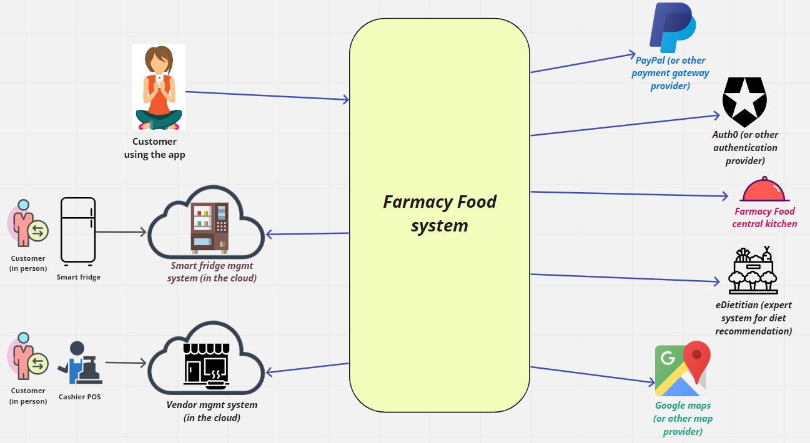
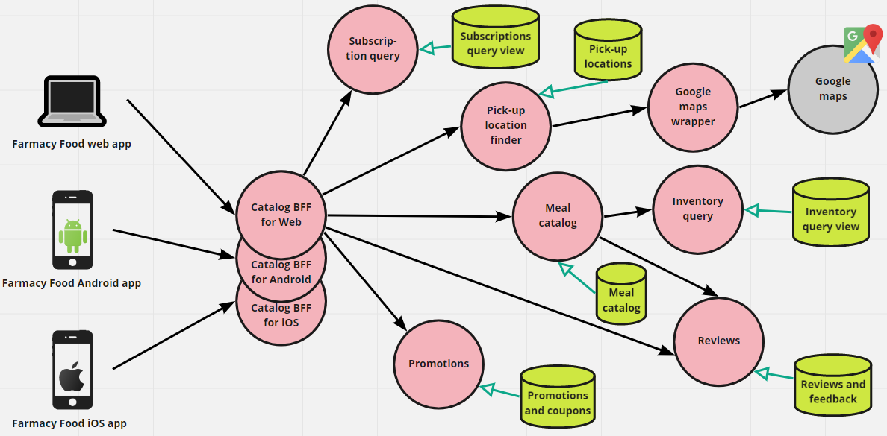
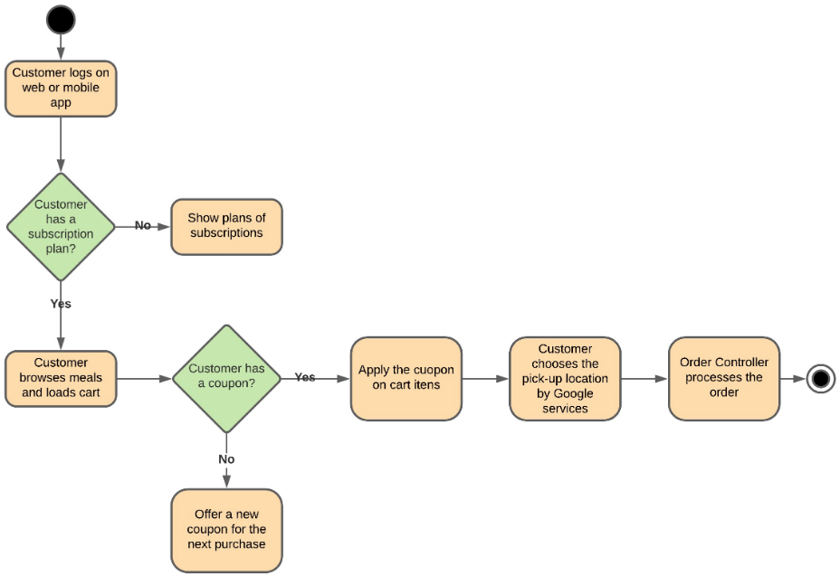
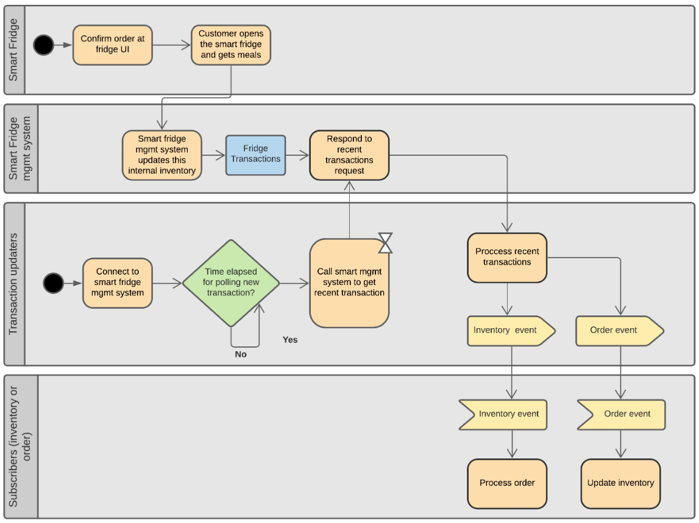
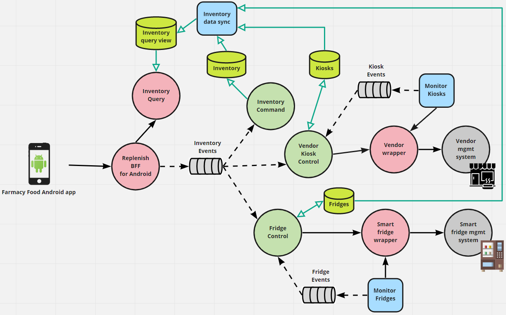
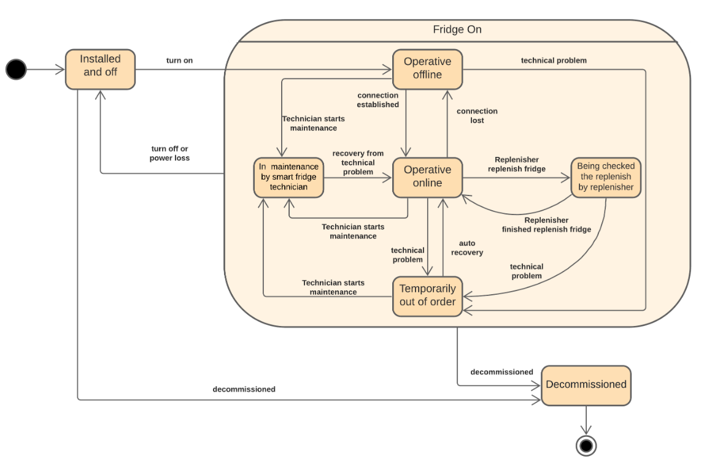
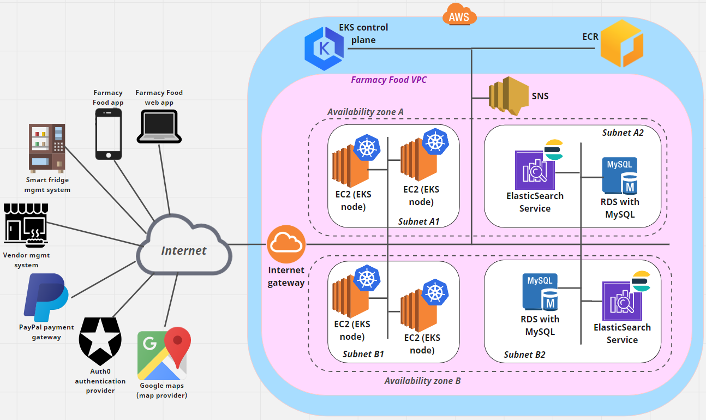

This is the github repo for the solution created by team Miyagi's Little Forests for the O'Reilly Architecture Kata. It contains a proposed architecture for [Farmacy Food](https://www.farmacyfood.com/).

# Farmacy Food system

### Requirements

This section brings the requirements (some from the [provided document](https://docs.google.com/document/d/1SML3n4JbpZV2PSLRpjaCvBvyUMVsFwlqAQF3VKd_oPU/edit#), 
some from assumptions we made) that served as drivers for the design decisions in this proposal. 

- [Functional requirements](requirements/functional-rqmts.md)
- [Quality attribute requirements](requirements/quality-attribute-rqmts.md), aka architecture characteristics

### Architecture

Here you find the documentation of the software architecture that we envision to address Farmacy Food's requirements. 

As a starting point, there's a context diagram that gives an overview of the external elements that interact with 
what we called the *Farmacy Food System*, which is the scope of this software architecture.

<table>
<tr><td align="center"><a href="architecture/context-diagram.md">Context Diagram </a></td></tr>
</table>

The main part of the software architecture is the set of five *architecture views* seen below. These views provide a runtime 
perspective of the system, that is, they show the components and connectors that have runtime presence and 
altogether correspond to the main capabilities provided by the Farmacy Food system. They follow the microservice and EDA
architecture styles. 

<table>
<tr>
    <td align="center"><a href="architecture/user-account-mgmt-microservice-view.md">User Account Management - microservice view </a></td>
    <td align="center"><a href="architecture/catalog-microservice-view.md">Catalog - microservice view 
        </a>
    </td>
</tr>
<tr>
    <td align="center"><a href="architecture/order-microservice-eda-view.md">Order - microservice and EDA view 
        </a>
    </td>
    <td align="center" valign="middle"><a href="architecture/customer-pickup-microservice-eda-view.md">Customer at pick-up location - microservice and EDA view 
        </a>
    </td>
</tr>
<tr>
    <td colspan="2" align="center">
        <a href="architecture/replenish-microservice-eda-view.md">Replenisher - microservice and EDA view 
        
        </a>
    </td>
</tr>
</table>

The following architecture view is a [DDD Context Map](https://learning.oreilly.com/library/view/patterns-principles-and/9781118714706/c07.xhtml). 
It shows how the Farmacy Food system is broken up into bounded contexts (BCs) and how they interact with each other. 

<table>
<tr><td align="center"><a href="architecture/ddd-context-map.md">DDD Context Map </a></td></tr>
</table>
 
We believe the implementation of each BC can follow the [hexagonal architecture](https://herbertograca.com/2017/11/16/explicit-architecture-01-ddd-hexagonal-onion-clean-cqrs-how-i-put-it-all-together/). 
The following architecture describes how the code of each BC can be structured according to this architecture style.  
 
<table>
<tr><td align="center"><a href="architecture/hexagonal-reference-architecture.md">Hexagonal reference architeture view </a></td></tr>
</table>

Finally, we have a deployment view that describes the runtime infrastructure for the components seen in the five 
runtime architecture views.    

<table>
<tr><td align="center"><a href="architecture/aws-deployment-view.md">AWS deployment view </a></td></tr>
</table>

### ADRs

The linked ADRs below record the main architecture decisions regarding the proposed design, including their context and rationale.

- ADR 001 - [Microservice style](ADRs/ADR001-microservice-style.md)
- ADR 002 - [Payment gateway](ADRs/ADR002-payment-gateway.md)
- ADR 003 - [BFF pattern](ADRs/ADR003-bff-pattern.md)
- ADR 004 - [Wrapper pattern](ADRs/ADR004-wrapper-pattern.md)
- ADR 005 - [CQRS pattern](ADRs/ADR005-cqrs-pattern.md)
- ADR 006 - [AWS as the cloud provider](ADRs/ADR006-aws-as-cloud-provider.md)

***Note***: we used [this ADR template](https://github.com/pmerson/ADR-template/blob/master/ADR-template.md). It is slightly 
different from the template presented by Neal during the first Kata session. 
The justification is in the [README file of the ADR template repo](https://github.com/pmerson/ADR-template/blob/master/README.md#why-this-template).

--------------------------

### Backlog
Pending design activities for a hypothetical future sprint. :^)
- Better record the quality attribute requirements (aka non-functional requirements). Requires talking to Kwaku and 
other Farmacy Food stakeholders.  
- Add information in the AWS deployment architecture related to:
    - containerization and pod configuration
    - security settings
    - log consolidation
    - monitoring and tracing
- Create architecture detailing the domain model at the tactical level. Examples of information in such views:
    - entities and VOs that form aggregates (or equivalent if not using DDD modeling)
    - domain events and event hierarchies  
- Write ADR for using an event-driven architecture for order processing.
- Add the description of components that are missing in the element catalogs of the architecture views.    

--------------------------

## *About the team Name*
*Miyagi's Little Forests is certainly an unusual name for a dev team. The name has both a pop culture and an academic reference:* 
- Mr. Miyagi is the shy Karate master in the 1984 "The Karate Kid" film. In the movie, which inspired a generation of then teenagers including 
the members of this team, Mr. Miyagi teaches the young Daniel-san the ancient art of Karate. The teaching of this martial art is anchored on Katas. 
Hence the nuanced connection to our architecture challenge.
- In a seminal 1976 [paper](https://www.ics.uci.edu/~andre/ics223w2006/deremerkron.pdf), Frank DeRemer and Hans Kron described 
like this the concern that 15 years later would drive the advent of the *software architecture* field: "However, current 
languages discourage the accurate recording of the overall solution structure; they force us to write programs in which 
we are so preoccupied with the trees that we lose sight of the forest, as do the readers of our programs!" For long, we 
have used the ability to see the forest and not only the trees as a metaphor for thinking the software architecture. 
- In The Karate Kid, Miyagi and Daniel-san form a team and open a store called *Miyagi's Little Trees*. So, paying 
homage to the movie and embracing the architecture metaphor, we are team **Miyagi's Little Forests**. 

