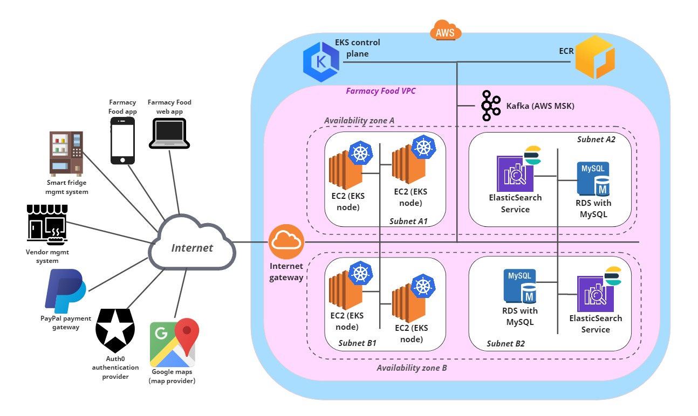
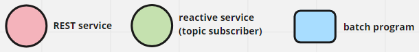
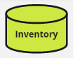
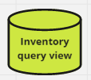

# AWS Deployment View 
This view shows how the server-side components of the Farmacy Food system can be deployed on the AWS platform. Useful links:
- This [web page](https://towardsdatascience.com/kubernetes-application-deployment-with-aws-eks-and-ecr-4600e11b2d3c) has
instructions on how to configure a K8S cluster on EKS using docker images in ECR.
- This [AWS doc page](https://docs.aws.amazon.com/eks/latest/userguide/eks-networking.html) describes restrictions and
guidelines for EKS topology.   

## Element Catalog 

#### EC2 (EKS node)
- The [Elastic Kubernetes Service](https://aws.amazon.com/eks/features/) (EKS) allows you to easily configure 
a Kubernetes (K8S) cluster in the AWS cloud. 
- Many of the tasks related to creating, configuring, and monitoring K8S nodes and clusters is done for you.
- A K8S cluster has *worker nodes* that run your application as docker containers that are deployed in *pods*. 
In EKS, these nodes are EC2 instances inside a private network (VPC) that you define within AWS. 
- The nodes in an EKS cluster should be in 2+ availability zones (AZs). The diagram illustrates two AZs.  
- We'll use the EKS cluster to run the following types of components seen in the microservice and EDA views:
  - microservices that contain REST services
  - microservices that contain reactive services (topic subscribers)
  - batch programs
  

#### EKS control plane
- This element represents K8S control plane nodes that oversee the execution of pods in the worker nodes. More 
information [here](https://kubernetes.io/docs/concepts/overview/components/).
- The EKS control plane executes under an AWS-managed account. That's why it's represented outside the Farmacy Food VPC.
      
#### ECR 
- The [Amazon Elastic Container Registry](https://aws.amazon.com/ecr/) (ECR) is a docker container registry that 
Farmacy Food will use within AWS to store the several docker images comprising the Farmacy Food system.
- ECR is an alternative to docker-hub. 
- It's a fully managed service provided by AWS.
      
#### RDS with MySQL
- [RDS](https://aws.amazon.com/rds/) is a relational database managed service by AWS. (There are other options for the 
database server to be used, such as  Oracle, PostgreSql, Aurora, but MySQL is eligible for AWS free tier and should 
reduce the upfront investment to set up and explore an AWS dev environment.)       
- Should be configured with the multi-AZ deployment option for increased availability.
- The Farmacy Food System will use RDS with MySQL as the master read-write data store to persist different types of data. 
For example, the **Inventory** database seen below will be configured as a set of tables in RDS.

    

#### Amazon Elasticsearch service
- The [Elasticsearch service on AWS](https://aws.amazon.com/elasticsearch-service/) (ES) is a fully managed text-based NoSQL 
database service that the Farmacy Food system will use for query views in different microservices.
- There will be an ES *domain* for Farmacy Food. This ES domain should use the Farmacy Food VPC to enable automatic
secure communication between application components (microservices and batch programs) and the ES nodes. 
- The ES domain should use multi-AZ deployment for increased availability. 
- The Farmacy Food System will use ES as the *query view* to be accessed by microservices that need to only read data. 
For example, the **Inventory Query View** database seen below will be configured using ES.

    

#### Kafka (AWS MSK)
- The [Amazon managed Kafka service](https://aws.amazon.com/msk/) (MSK) is a fully-managed Kafka broker cluster that 
  supports publish-subscribe channels (called topics).
- Components that send messages (producers aka publishers) and receive messages (consumers aka subcribers) can be 
implemented using various languages and frameworks. For example, we can use the [spring cloud AWS](https://www.baeldung.com/spring-cloud-aws-messaging
framework.  
- The various topics seen in the EDA architecture views shall be configured in the MSK cluster with minimum replication factor of 3.  

 
#### Availability zone A, Availability zone B
- An [availability zone](https://docs.aws.amazon.com/AWSEC2/latest/UserGuide/using-regions-availability-zones.html#concepts-availability-zones) 
(AZ) is a data center with its own power supply and network connectivity.
- AZs are located within regions. Deploying cloud services/resources in 2+ AZs in the same region is the basic mechanism 
for improved availability due to automatic failover.    
 
#### Subnet A1, A2, B1, B2
- A [subnet](https://docs.aws.amazon.com/vpc/latest/userguide/what-is-amazon-vpc.html) is a range of IP addresses within 
a [virtual private cloud](https://docs.aws.amazon.com/vpc/latest/userguide/VPC_Subnets.html) (VPC).
- Subnets A1 and B1 and *public* subnets, visible to the Internet via an AWS internet gateway.
- Subnets A2 and B2 are *private* subnets. They can be connected to the Farmacy Food corporate LAN (not shown in the diagram). 
- Although RDS and ES can be configured outside your VPC, we have them in private "db" subnets in the diagram as a 
measure to protect them from unauthorized access.  
 
## Behavior
N/A
 
## Related ADRs 
- [AWS as the cloud provider](../ADRs/ADR006-aws-as-cloud-provider.md)
- [CQRS pattern](../ADRs/ADR005-cqrs-pattern.md)

## Related Views
- [User Account Management - microservice view](user-account-mgmt-microservice-view.md)
- [Catalog - microservice view](catalog-microservice-view.md)
- [Order - microservice and EDA view](order-microservice-eda-view.md)
- [Catalog - microservice view](catalog-microservice-view.md)
- [Replenisher - microservice and EDA view](replenish-microservice-eda-view.md) 
- [Hexagonal reference architeture view](hexagonal-reference-architecture.md) 
