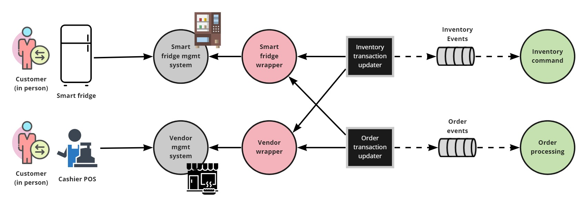

# Customer at Pick-up Location Microservice and EDA View 
The scope is the operations that the customer can perform in person.
In these scenarios, either the smart fridge or the cashier POS acts as entry points to the system.
 
The interactions include:
- picking up already ordered meals; and
- purchasing meals on the spot and collecting it right away.

This is a microservice architecture. Key patterns used:
- Wrapper (aka Legacy Wrapper, Anticorruption Layer)
- CQRS
- Publish-subscribe (in the event-driven architecture)

## Element Catalog 

#### Customer, Smart Fridge, Cashier POS
- The actual customer (in person), Smart Fridge and cashier POS.

#### Smart fridge management system, Vendor management system
- Systems that provide APIs for querying and managing the state of the smart fridges
and vendor management systems.
- Proprietary technology, managed by third-parties.

#### Smart fridge mgmt system
- This gray circle represents the cloud-based system and API provided by a contracted smart fridge provider (third-party).
- It offers the external API that Farmacy Food will interact with for sending and receiving information about fridges 
(status, inventory), orders, and purchases. 

#### Smart fridge wrapper
- [Wrapper service](../ADRs/ADR004-wrapper-pattern.md) for interacting with a third-party smart fridge partner in the cloud.
- It knows all the details (message formats and structures, authentication keys, etc.) to interact with the Smart fridge
mgmt system. It works as an anticorruption layer (ACL).  
- The goal of the wrapper services is to avoid tight coupling between Farmacy Food business logic implementation and 
   the specifics of each third-party system. The diagram illustrates one such interaction. If Farmacy Food has a 
   contract with 2+ fridge providers, then there should be one wrapper service for each.  

#### Vendor mgmt system
- This gray circle represents the cloud-based system and API provided by a vendor partner (e.g., Starbucks). 
- It offers the external API that Farmacy Food will interact with for sending and receiving information about orders
and local store inventory. 

#### Vendor wrapper
- [Wrapper service](../ADRs/ADR004-wrapper-pattern.md) for interacting with a third-party vendor partner in the cloud.
- It knows all the details (message formats and structures, authentication keys, etc.) to interact with the Vendor 
mgmt system. It works as an anticorruption layer (ACL).  
- The goal of the wrapper services is to avoid tight coupling between Farmacy Food business logic implementation and 
   the specifics of each third-party system. The diagram illustrates one such interaction. If Farmacy Food has a 
   contract with 2+ vendors, then there should be one wrapper service for each.  

#### Pick-up transaction updater
- A batch program that queries the Smart Fridge and Vendor management systems for updates. Changes are
posted to the Inventory and Order topics for later handling by the `Inventory command` and
`Order processing` services.

#### Inventory Command
- Reactive service (topic subscriber) that handles commands updating the inventory.

#### Order processing 
- Reactive service (topic subscriber) responsible for processing events about orders.

## Behavior
- UML activity diagram to explain how the inventory and order processing are done in farmacy food system, when a customer pick-up a meal on the smart fridge.

 
## Related ADRs 
- [CQRS pattern](../ADRs/ADR005-cqrs-pattern.md)
- [Wrapper pattern](../ADRs/ADR004-wrapper-pattern.md)

## Related Views
- [Order - microservice and EDA view](order-microservice-eda-view.md) 
- [Replenisher - microservice and EDA view](replenish-microservice-eda-view.md) 
