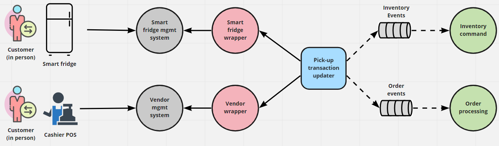

# Customer Pickup Microservice View 
The scope is the operations that the customer can perform having the smart fridge or the POS cashier as
entry point. These interactions include picking up an already ordered food and purchasing an item on
the spot and retrieving it right away.

This is a microservice architecture. Key patterns used:
- Wrapper (aka Legacy Wrapper, Anticorruption Layer)
- CQRS
- Publish-subscribe (in the event-driven architecture)

## Element Catalog 

#### Customer, Smart Fridge, POS Cashier
- The actual customer (in person), Smart Fridge and POS Cashier.

#### Smart fridge management system, Vendor management system
- Systems that provide APIs for querying and managing the state of the smart fridges
and vendor management systems.
- Proprietary technology, managed by third-parties.

#### Pick-up transaction updater
- A batch program that queries the Smart Fridge and Vendor management systems for updates and
posts them on the Inventory and Order topics for later handling by the `Inventory command` and
`Order processing` services.

#### Inventory Command (?)
- Service that handles commands updating the inventory.

#### Order processing (?)
- Component responsible for processing events about orders.

## Behavior
- N/A.
 
## Related ADRs 
- [CQRS pattern](../ADRs/ADR004-cqrs-pattern.md)
- [Wrapper pattern](../ADRs/ADR003-wrapper-pattern.md)

## Related Views
- [Order - microservice and EDA view](../architecture/order-runtime-view.md) 
