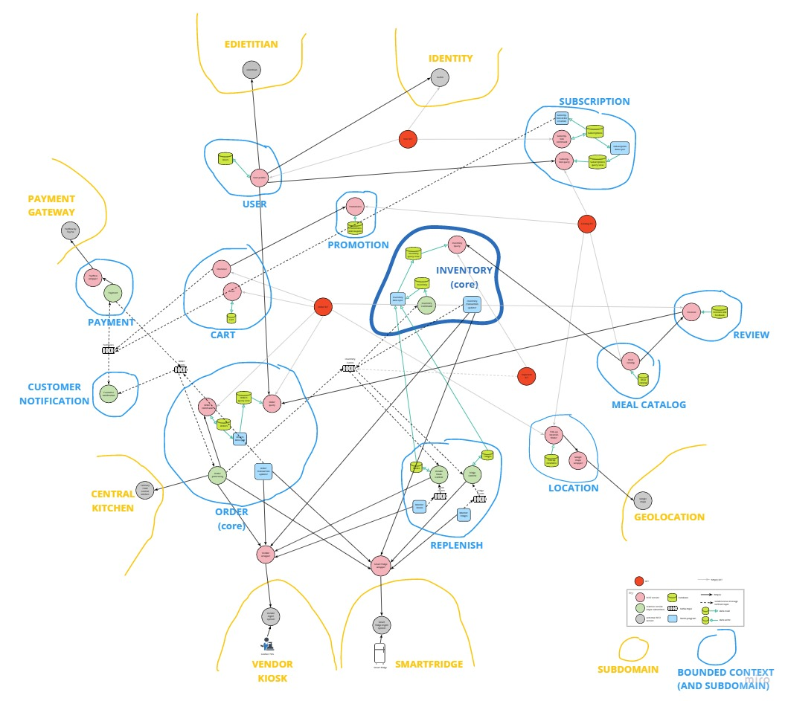

# DDD Context Map to Microservices Mapping

This view is actually a mapping between the [DDD Context Map](ddd-context-map.md) and the microservice/EDA views, which are all listed below:
- [User Account Management - microservice view](user-account-mgmt-microservice-view.md)
- [Catalog - microservice view](catalog-microservice-view.md)
- [Order - microservice and EDA view](order-microservice-eda-view.md)
- [Customer at Pick-up Location Microservice and EDA View](customer-pickup-microservice-eda-view.md)
- [Replenisher - microservice and EDA view](replenish-microservice-eda-view.md)
 
As such, this diagram provides a unique perspective on how each BC maps to microservices. BFFs play the role of an anticorruption layer. 
They were drawn in read and between BCs, but could arguably be within the BC the services they call are part of. 
 

## Element Catalog 

*See element catalog of the mapped views.*

## Behavior
- N/A.
 
## Related ADRs 

- N/A.

## Related Views
- [DDD Context Map](ddd-context-map.md)
- [User Account Management - microservice view](user-account-mgmt-microservice-view.md)
- [Catalog - microservice view](catalog-microservice-view.md)
- [Order - microservice and EDA view](order-microservice-eda-view.md)
- [Customer at Pick-up Location Microservice and EDA View](customer-pickup-microservice-eda-view.md)
- [Replenisher - microservice and EDA view](replenish-microservice-eda-view.md)
