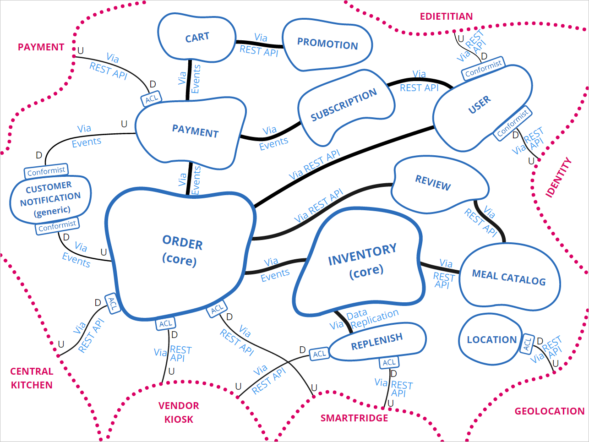
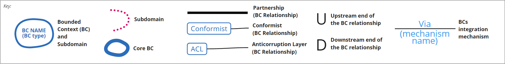
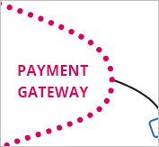
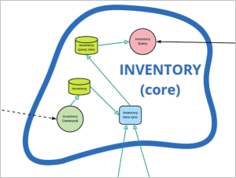
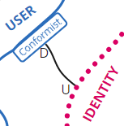
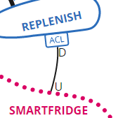
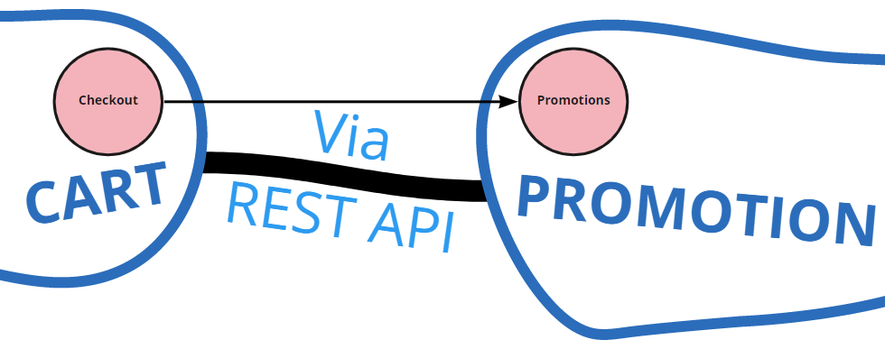
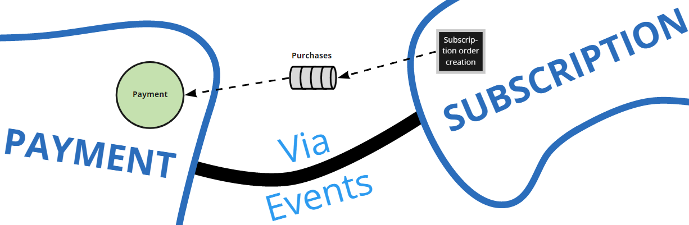
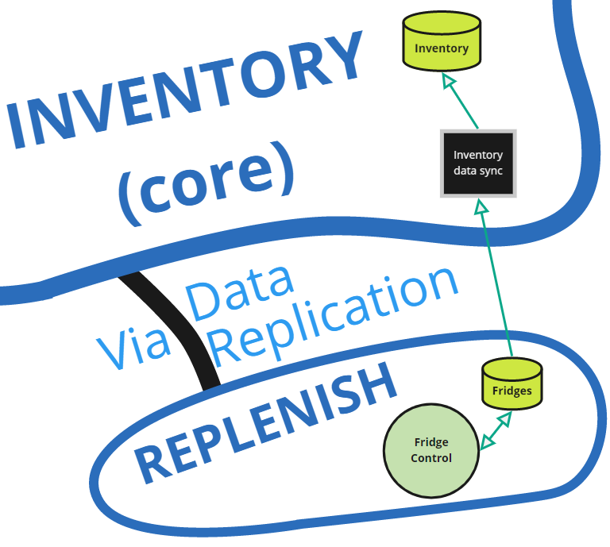

# DDD Context Map

<!-- Short description of the scope and nature of this architecture view. --> 

The following architecture view is a [DDD Context Map](https://learning.oreilly.com/library/view/patterns-principles-and/9781118714706/c07.xhtml). 
It shows how the Farmacy Food system is broken up into bounded contexts (BCs) and how they interact with each other. 

**On the relationships.** EXPLAIN why we chose INVENTORY and ORDER as core.
Given it is a startup with most likely one development team, we specified the relationships as *Partnership*.
Other kinds of relationships may be possible, depending on the dynamics.

## Element Catalog 

<!--
#### Element X
- info
- info
-->

#### Subdomain

- Subdomains are yadda yadda.

- Subdomains
    - Payment Gateway (Subdomain)
    
    - Smartfridge (Subdomain)
        <!-- - Our system:
            - Posts or updates a purchase order on the Smart Fridge system: consumer identification; meals and quantities; smart fridge location; date and time range availability
                - Done after a customer places, edits or cancels an order for smart fridge pick up
            - Query pick up and purchase transactions 
                - Done periodically to find out about picked up orders and ad hoc purchases
                - Can be combined or replaced with a push notification mechanism, if the smart fridge system has that ability
            - Query inventory levels of one or more fridges
                - Done when the customer is searching for meal availability per location
            - Update fridge inventory 
                - Done after the replenisher replenishes a fridge or confirms stock after visual inspection
            - Query fridge status
            - Update fridge status
                - Done after the replenisher detects an issue or change of status in a fridge -->
        
    - Vendor Kiosk (Subdomain)
        <!-- - Post or update a purchase order: consumer identification; meals and quantities; vendor store location; date and time range availability 
            - Done after a customer places, edits or cancels an order for vendor kiosk pick up
        - Query pick up and purchase transactions 
            - Done periodically to find out about picked up orders and ad hoc purchases
            - Can be combined or replaced with a push notification mechanism, if the vendor POS system has that ability -->
        
    - Central Kitchen (Subdomain)
        <!-- - Post meal orders
        - Post inventory levels for smart fridges
        - Post inventory levels for vendor POS -->
        
    - Geolocation (Subdomain)
    - Identity (Subdomain)
    - eDietitian (Subdomain)

#### Bounded Context

- BCs are yadda yadda.
- BCs (TODO: reorder)
    - Meal Catalog (BC) - what could possibly be available
        <!-- - ingredients, nutrition facts -->
    
    - Inventory (BC/core) - what is currently available, where
        <!-- - replenishment interactions -->
     
    - User (BC) - the clients
        <!-- - profile information
        - dietary restrictions
        - health information/goals
        [CONN] purchase history, reviews made -->
    
    - Review (BC) - extra data on catalog
        <!-- - Meals reviews and ratings
        - Surveys -->
    
    - Order (BC/core)
        <!-- - Orders
        - meal subscription
        - Check out:
            review cart;
            select pick-up location (with find functionality);
            enter coupon;
            enter payment information;
            review and confirm order (meals, pick-up location, date and time range);
            display order confirmation code and pick up instructions
        [CONN] - Send notification about an order (payment, pick-up etc) -->
    - Cart (BC)
    
    - Payment (BC)
    
    - Subscription (BC)
        <!-- - available subscription plans
        - ongoing subscriptions
        - history -->
    
    - Promotion (BC)
        <!-- - promotions and coupons  -->
    
    - Location (BC) - smart fridges, representative run kiosks, Farmacy Food-run restaurants
        <!-- - smart fridges/representative run kiosks
            - geographical location and status
            - other relevant data (owner, maintenance contact)
        - Smart fridge
          - [CONN] Use credit or debit card used for online order to open fridge, and pick up order
          - [CONN] Enter online order confirmation code to open fridge, and pick up order
          - [CONN] Select available meal, pay using credit or debit card to open fridge, and pick up order
        - Vendor kiosk
          - [CONN] Present credit or debit card used for online order to cashier, and pick up order
          - [CONN] Present online order confirmation code to cashier, and pick up order
          - [CONN] Pick Farmacy Food meals, possibly alongside other store items, and pay for everything at the cashier -->
    
    - Replenish (BC)
    - Customer Notification (BC)

#### Conformist (BC Relationship)
- 
- info
- Explain U/D semantics

#### Anticorruption Layer - ACL (BC Relationship)
- 
- info
- Explain U/D semantics

#### Types of Technical Integrations between BCs
- Via REST API
    - 
    - info
- Via Events
    - 
    - info
- Via Data Replication
    - 
    - info

## Behavior
- N/A.
 
## Related ADRs 
- [Microservice style](../ADRs/ADR001-microservice-style.md)
- [Wrapper pattern](../ADRs/ADR004-wrapper-pattern.md)
- [Payment gateway](../ADRs/ADR002-payment-gateway.md)

<!--
- [AWS as the cloud provider](../ADRs/ADR006-aws-as-cloud-provider.md)
- [BFF pattern](../ADRs/ADR002-bff-pattern.md)cu
- [CQRS pattern](../ADRs/ADR005-cqrs-pattern.md)

-->

## Related Views
- [Context Diagram](context-diagram.md)
- [Hexagonal reference architeture view](hexagonal-reference-architecture.md)
- [User Account Management - microservice view](user-account-mgmt-microservice-view.md)
- [Catalog - microservice view](catalog-microservice-view.md)
- [Order - microservice and EDA view](order-microservice-eda-view.md)
- [Customer at Pick-up Location Microservice and EDA View](customer-pickup-microservice-eda-view.md)
- [Replenisher - microservice and EDA view](replenish-microservice-eda-view.md)

<!--
- [AWS Deployment view](aws-deployment-view.md)
--> 
