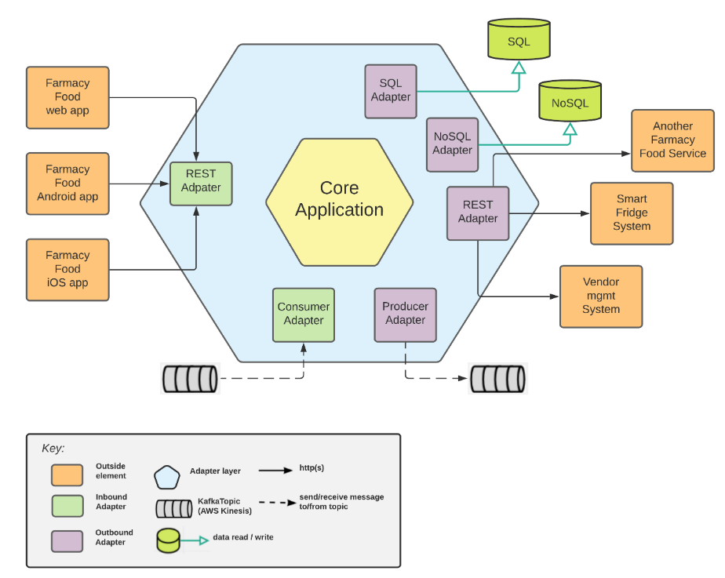

# Hexagonal Reference Architecture View 
This view describes the [hexagonal reference architecture](https://alistair.cockburn.us/hexagonal-architecture/) for a typical 
bounded context (BC) in the Farmacy Food system. The diagram shows the interaction between external components and the 
Farmacy Food BC via *adapters*. This hexagonal architecture prescribes that technology-specific logic be 
placed in adapters, which isolate the application and domain layers. 

The execution of an *inbound adapter* is activated by an external element. These adapters typically call logic that
is not technology specific and resides in the "Application + Domain" layer in the center. 

*Outbound adapters* are used by the application to interact with other external elements: reading or writing to/from 
databases), calling http services, publishing events to a message broker topic.   

## Element Catalog 

#### REST Adapter
- An *inbound* REST adapter exposes http endpoints and handles the requests from outside components.
- If you create an inbound REST adapter using for example the Spring MVC framework, the REST adapter would typically 
consist of one or more `@RestController` classes.
- An *oubbound* REST adapter makes calls to http services. It typically offers an function interface that is called
by the application and then translates that function call into an http request. 
- You can use for example the Open Feign framework to implement an outbound REST adapter.   

#### Application + Domain 
- Application elements are called from adapters and provide communication with the domain. 
- In general, domain objects cannot leak outside of the domain area. Ordinarily, domain objects are wrapped in DTOs (Data 
Transfer Objects) and returned to outside elements.

#### Batch Adapter
- Executes scheduled tasks typically following a cron table.
- Typically, these tasks pool components like REST services or datasources. Their purpose can be, for example, syncrhonize 
data between a master data store and its replicas, or call third-party systems to get updates on activate processing. 

## Behavior
- N/A.
 
## Related ADRs 
- [BFF pattern](../ADRs/ADR002-bff-pattern.md)
- [Wrapper pattern](../ADRs/ADR003-wrapper-pattern.md)
- [Microservice pattern](../ADRs/ADR004-cqrs-pattern.md)

## Related Views
- [Context Diagram](context-diagram.md)
- [AWS Deployment view](aws-deployment-view.md)
