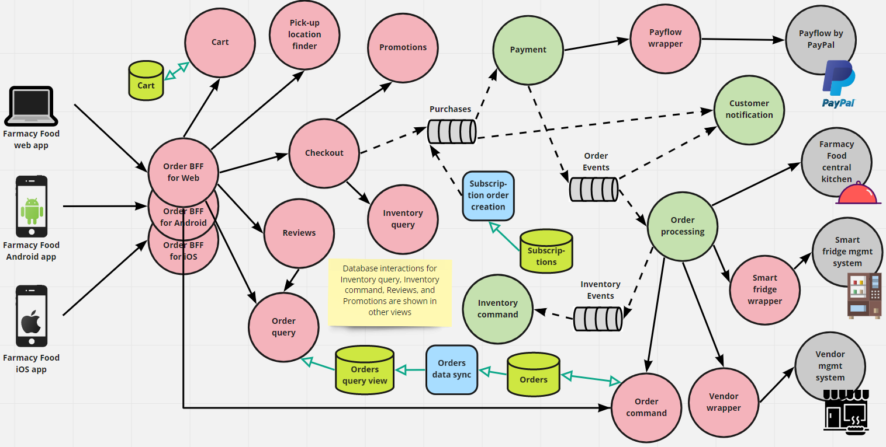
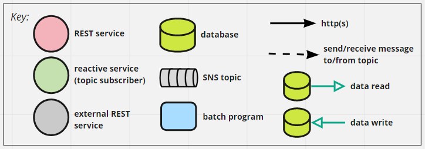

# Order Microservice and EDA View 
This view covers all functionality related to placing an order: adding/removing items from a shopping cart, selecting
a pick-up location for the order, checkout with payment validation and order processing, querying, viewing and 
cancelling existing orders, rating meals and creating reviews for verified purchases. 

This is a microservice architecture that also uses the event-driven architecture (EDA) architecture style for 
processing an order. Key patterns used:
- BFF
- Database per Microservice (aka Database per Service)
- Wrapper (aka Legacy Wrapper, Anticorruption Layer)
- CQRS
- Publish-subscribe (in the event-driven architecture) 

## Element Catalog 

#### Checkout
- Handles the requests from the frontend apps relative to the different steps the customer goes through when they
click checkout. 
- It allows the user to apply a coupon, in which case the service interacts with the `Promotions` service to validate the
coupon and recalculate the cost based on the discount. 
- When processing the final submit for the meal order, `Checkout` calls `Inventory query` for validating the order against 
  meal availability in the selected pick-up location (if one was chosen). If everything is OK, a domain event "Purchase Order Created" 
  is published. 
- The purchase order is processed asynchronouly, as described in the [sequence diagram](#behavior) further down. 

#### Payment
- Will process the payment for a submitted purchase order. 
- Uses a third-party payment gateway. To avoid coupling the logic to one specific payment gateway provider, the interaction
is through a wrapper service. 
- If the payment is sucessful, `Payment` publishes a Order Payment Confirmed event containing all order details and
payment status.  

#### Payflow wrapper
- Payflow is the payment gateway service for PayPal. We used it as a (likely) example of payment gateway. 

#### Payflow by PayPal
- External payment gateway service that offers a public API to merchant partners. 

#### Smart fridge mgmt system
- See [catalog in the Customer at Pick-up Location Microservice and EDA View](customer-pickup-microservice-eda-view.md).

#### Smart fridge wrapper
- See [catalog in the Customer at Pick-up Location Microservice and EDA View](customer-pickup-microservice-eda-view.md).

#### Vendor mgmt system
- See [catalog in the Customer at Pick-up Location Microservice and EDA View](customer-pickup-microservice-eda-view.md).

#### Vendor wrapper
- See [catalog in the Customer at Pick-up Location Microservice and EDA View](customer-pickup-microservice-eda-view.md).

#### Customer notification
- Reponsible for sending out notifications to the customers via one or more mechanisms: 
    - email
    - app push notification
    - SMS  
    - WhatsApp
- It subscribes to various events and puts together the corresponding personalized messages according to pre-defined templates.  

#### Order command
- Has basic operations for creating or modifying an order.
- It's invoked:
    - by *Order processing* when a meal order is placed.  
    - by *Order BFF* when the customer updates or cancels an order.   
- It uses the CQRS pattern. 

#### Reviews
- Has endpoints to allow the customer to rate meals, add reviews, or give non-public feedback for verified purchases
- Has also endpoints for querying and searching reviews and ratings. These endpoints are used when looking at a meal item 
from the [catalog](catalog-microservice-view.md).  

## Behavior
* The diagram below shows the sequence of messages for closing an online order that is successful for a meal order to
be picked up at a smart fridge location. 
* The diagram uses the UML Sequence Diagram notation, except that we used our component symbols up on top instead of
UML objects.   

 
## Related ADRs 
- [Payment gateway](../ADRs/ADR002-payment-gateway.md)
- [Wrapper pattern](../ADRs/ADR004-wrapper-pattern.md)
- [CQRS pattern](../ADRs/ADR005-cqrs-pattern.md)
- [BFF pattern](../ADRs/ADR003-bff-pattern.md)

## Related Views
- [Customer Account Management - microservice view](user-account-mgmt-microservice-view.md)
- [Catalog - microservice view](catalog-microservice-view.md)
