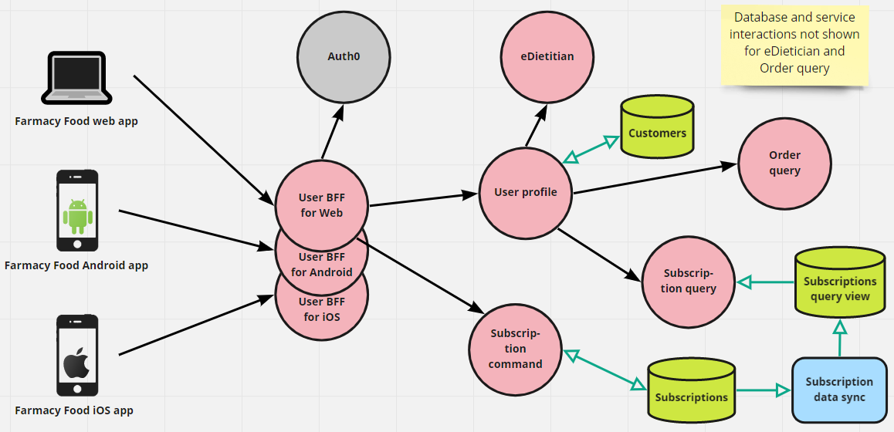

# Customer Account Management Microservice View 
The scope is the operations that the customer can perform related to creating and managing an account and user profile,
which includes signing in using a Farmacy Food user ID and password or different credentials (Google, Facebook, etc.). 

This is a microservice architecture. Key patterns used:
- BFF
- Database per Microservice (aka Database per Service)
- CQRS 

## Element Catalog 

#### Farmacy Food web app
- Web application created using an SPA framework, such as Vue or React.

#### User BFF for Web, for Android, for iOS
- Central access point for calls coming from the frontend apps.
- These are the 3 types of frontend we added BFFs for in the design. However, other types of frontends/clients like the
ones listed below can be added by specifying new BFFs for them:
    - A chatbot client that interacts via SMS, Tweeter, WhatsApp. 
    - A public API client to get calls from other websites.
    - Amazon seller API, so Farmacy Food meals can be sold on Amazon.

#### Auth
- Handles user sign in using a Farmacy Food user ID and password.

#### Auth0
- External provider for Open ID authentication that allows users to create a Farmacy Food account using their Google or
Facebook account.
- The interaction with Auth0 is similar to what you see [in this diagram](https://www.getambassador.io/docs/latest/topics/using/filters/oauth2/#the-ambassador-authentication-flow), except that the BFF plays the role of the *Ambassador Edge Stack*.

#### eDietician
- "Expert system" that will provide personalized meal recommendations based on different criteria:
    - customer's dietary restrictions and health information,
    - customer's purchase history, and/or
    - meal ratings.
- Internal design alternatives:
    - use a traditional rules engine (BRMS),
    - use machine learning techniques to build a meal recommendation model, or
    - use an external service that offers this functionality on the Web.

## Behavior
- N/A.
 
## Related ADRs 
- [BFF pattern](../ADRs/ADR002-bff-pattern.md)
- [CQRS pattern](../ADRs/ADR004-cqrs-pattern.md)

## Related Views
- [Catalog - microservice view](catalog-microservice-view.md)
- [Order - microservice and EDA view](order-microservice-eda-view.md)
